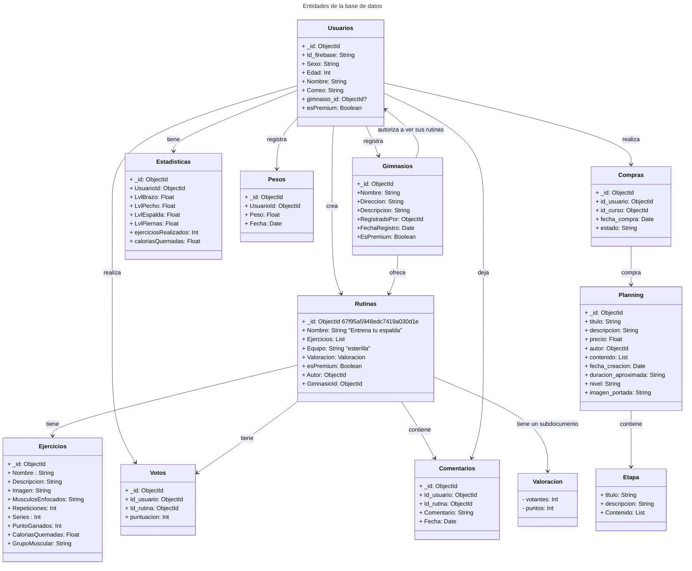
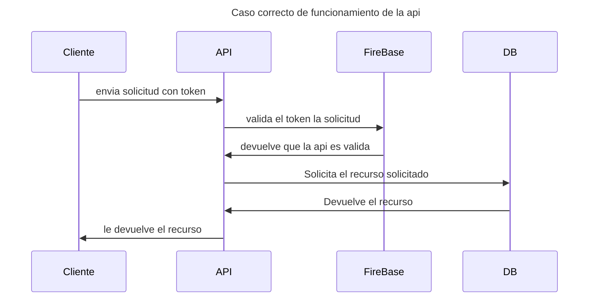
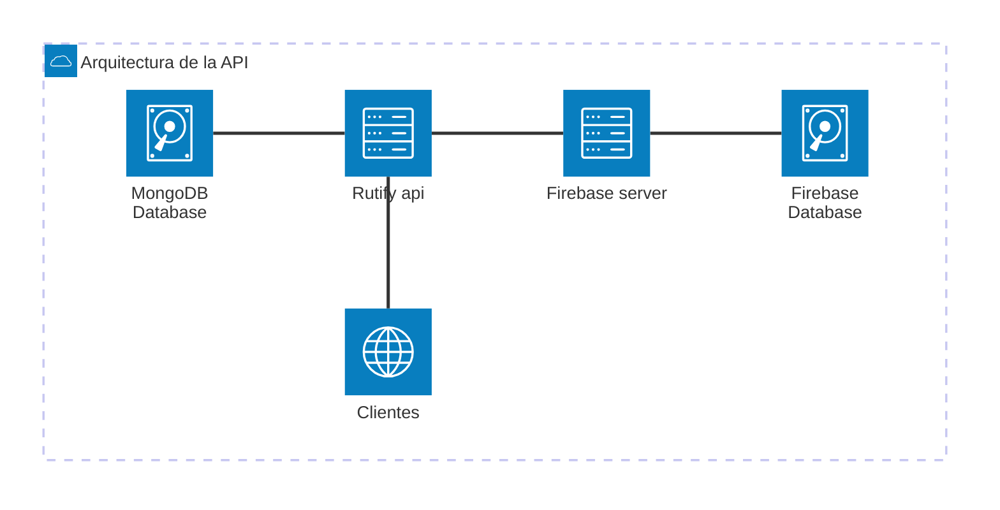

# Rutify
# App de gimnasio

# Introduccion
- EntrenaFácil es una aplicación diseñada para eliminar las barreras que impiden a muchas personas comenzar a entrenar de forma adecuada. Ya sea por desconocimiento, falta de experiencia o recursos limitados, especialmente en jóvenes o personas que desean entrenar desde casa, esta plataforma ofrece una guía completa y accesible para entrenar correctamente en casa o en el gimnasio.
- Nuestra misión es proporcionar rutinas personalizadas, ejercicios guiados, y herramientas motivacionales para que cualquier persona, sin importar su nivel, pueda adoptar un estilo de vida activo y saludable con confianza y seguridad.
## Cronograma de Desarrollo

- Función
  - Este diagrama de Gantt permite visualizar el cronograma de desarrollo de la API de Rutify.
  Refleja la planificación temporal de tareas clave, como la creación del proyecto, 
  diseño en Figma, y definición de entidades, así como la entrega final.
```mermaid
gantt
dateFormat  DD-MM-YYYY
title       Diagrama temporal de la api   
section Acciones

    Creacion del proyecto: 1, 09-04-2024,1d

    Creo plan de desarrollo en trello: 2, 09-04-2024,1d

    mejoro la interfaz en figma: 3, 09-04-2024,1d
    Popular la base de datos : 4, 11-04-2024,1d
    Defino las entidades: 5, 15-04-2024,1d
    controlador Usuarios realizados: 6, 19/04/2025, 5d

    entrega de proyecto: milestone, final, 15-06-2024,1d
section errores encontrados
```


- Función
  - Representa las entidades principales del sistema (Usuarios, Rutinas, Votos, Comentarios, Ejercicios) 
  y sus relaciones. Es esencial para comprender cómo se estructura la base de datos MongoDB y 
  cómo interactúan los elementos del dominio.


- Función
  - Este diagrama de secuencia muestra el flujo de una solicitud válida en la API de Rutify, 
  destacando cómo el cliente se autentica mediante Firebase, y cómo la API actúa como intermediaria 
  entre el cliente y la base de datos. Es útil para representar escenarios reales de funcionamiento de la app.


- Función
  - Describe gráficamente la arquitectura lógica del sistema. 
    Presenta los principales componentes: cliente móvil, servidor de API, 
    Firebase y MongoDB, y cómo se comunican entre ellos.

## Tecnologias
- Firebase (gestion de usuarios y autenticacion JWT)
- Mongo db (base de datos para los ejercicios y rutinas de los usuarios o app)
- Librerias:
  - detekt (comprobador de calidad de codigo)
  - Kover (cobertura de codigo)
## funcionalidades

### funcionalidades realizadas:
- el usuario se puede registrar e iniciar sesion en mi plataforma
  - mediante firebase, me da la autenticacion y seguridad 
### Futuras funcionalidades:

- el usuario puede puntuar de 1 a 5 estrellas las rutinas que el haya hecho
- el usuario podra escribir articulos en mi plataforma
- el usuario podra crear sus propias rutinas y compartirlas(usuario de pago)
- el usuario podra hacer amigos dentro de la app
- el usuario podra tener ejercicios favoritos guardados localmente


# apuntes

el Ifirebase, sera mi clave maestra
las stas se guardan con el id de firebase que se guarda en mongo tmb